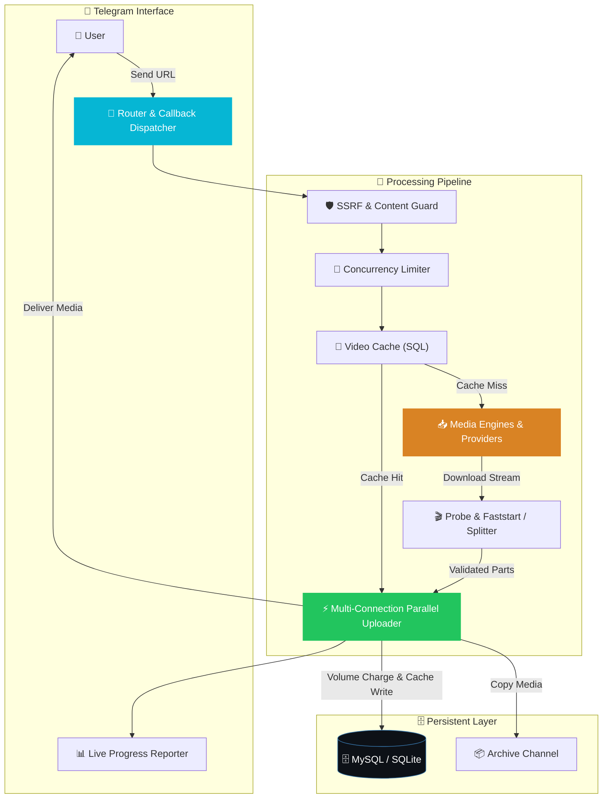

<div align="center">

<br>

### High-Performance Telegram Media Download Bot
**Downloads from YouTube, TikTok, Instagram, and direct links — powered by Telethon MTProto.**<br>
Ground-up rewrite: parallel multi-connection uploads, adaptive provider fallbacks, schema-compatible DB continuity, and an intuitive Hebrew interface.

<br>

<a href="#-quick-start"></a>
<a href="#-features"></a>
<a href="#-architecture"></a>
<a href="#️-deploying-to-the-server"></a>

<br><br>


</div>

---

## 📑 Table of Contents

<table>
<tr>
<td valign="top" width="33%">

**Getting Started**
- [✨ Features](#-features)
- [🧠 Architecture](#-architecture)
- [🚀 Quick Start](#-quick-start)
- [🎮 Interactive Workflow](#-interactive-workflow)

</td>
<td valign="top" width="33%">

**Production & Operations**
- [⚙️ Deploying to the Server](#️-deploying-to-the-server)
- [🧱 Project Structure](#-project-structure)
- [🔧 Configuration Matrix](#-configuration-matrix)

</td>
<td valign="top" width="33%">

**Reliability & Policy**
- [💡 Design Decisions / Reliability](#-design-decisions--reliability)
- [⚠️ Known Limitations](#️-known-limitations)
- [📜 License & Credits](#-license--credits)

</td>
</tr>
</table>

---

## ✨ Features

<table>
<tr>
<td width="33%" valign="top">

### 🎬 Universal Media Ingestion
Extracts video and audio from **YouTube**, **TikTok**, **Instagram**, and **direct HTTP(S)** links. Supports YouTube playlists and TikTok/Instagram photo slideshows.

</td>
<td width="33%" valign="top">

### ⚡ Multi-Connection Upload
Uploads large files over up to **5 parallel lanes** distributed across **separate real TCP connections** directly to Telegram Data Centers using an in-memory shared MTProto key.

</td>
<td width="33%" valign="top">

### 🌐 Adaptive Provider Fallback
Automated fallback across external scrapers (`tikwm`, `tikdownloader`, `musicaldown`, `cobalt`, `ytmp3`) with dynamic health tracking and latency sorting in MySQL.

</td>
</tr>
<tr>
<td valign="top">

### 🎚️ Interactive Quality & Audio
In-chat resolution picker (1080p, 720p, 480p, 360p) and dedicated **MP3 audio extraction** (192kbps) with ID3v2 tags and embedded album art.

</td>
<td valign="top">

### ✂️ Smart 2GB+ File Splitting
Splits files exceeding Telegram's 2GB bot limit into numbered parts (`📎 חלק i/N`) using `ffmpeg`, preserving streamable faststart headers without re-encoding.

</td>
<td valign="top">

### 🗄️ Zero-Reupload Archive Cache
Archives delivered media to a private channel. Repeat requests re-send media instantly server-side without re-downloading, re-uploading, or "Forwarded from" headers.

</td>
</tr>
<tr>
<td valign="top">

### 📊 Bi-Directional Live Progress
Real-time progress widget edited in place with dynamic progress bar, downloaded size, speed, and ETA. Formatted with explicit bi-di RTL/LTR embeddings.

</td>
<td valign="top">

### 🛡️ Multi-Layer Security Guard
Comprehensive SSRF protection with redirect hop address inspection, path traversal sanitization, 200-byte safe filenames, and body content sniffing.

</td>
<td valign="top">

### 💳 Fair Volume Billing
Credits deduct strictly by delivered volume (`max(1, ceil(MB / MB_PER_CREDIT))`) **after** successful upload. On a partial delivery (e.g. a multi-part split where only some parts land) only the parts actually delivered are charged; if nothing was delivered, there is no charge.

</td>
</tr>
<tr>
<td valign="top">

### 🛑 Active Task Cancellation
Inline `[ ❌ ביטול ]` button sets a cancellation token and closes the underlying HTTP response, stopping in-flight downloads cooperatively and cleaning up temporary disk fragments. On the yt-dlp path (YouTube), the worker thread notices the token within roughly 1-2 seconds rather than instantly.

</td>
<td valign="top">

### 🔄 Intelligent One-Click Retry
Transient network errors attach an inline `[ 🔄 נסה שוב ]` button backed by an in-memory TTL store. Irrecoverable failures (e.g. blocked user, oversized) omit it.

</td>
<td valign="top">

### 🌊 "Wait Over Fail" Flood Policy
Resilient flood handling: sleeps exact wait times, degrades upload lanes (5 → 2 → 1), and avoids artificial cumulative timeouts during active delivery.

</td>
</tr>
</table>

---

## 🧠 Architecture

`media-bot-v2` operates as an asynchronous pipeline orchestrated via **Telethon**, coordinating between platform extractors, transcoding subprocesses, persistent storage, and Telegram's MTProto API:



### End-to-End Request State Flow

```mermaid
stateDiagram-v2
    [*] --> Ingested: URL received in private chat
    Ingested --> HostRouting: Parse netloc & check scheme
    HostRouting --> QualityMenu: YouTube -> Prompt quality / audio
    HostRouting --> EngineDispatch: TikTok / Instagram / Direct
    QualityMenu --> EngineDispatch: User selects resolution
    EngineDispatch --> CacheCheck: Compute deterministic cache key
    CacheCheck --> CacheServe: Key exists in video_cache -> Resend from archive
    CacheCheck --> Downloading: Cache miss -> Acquire concurrency slot
    Downloading --> GuardValidation: SSRF guard; direct-link engine also does a preflight HEAD check & body sniffing
    GuardValidation --> Transcode: Probe media info, fix streamable MP4, or split >2GB
    Transcode --> Uploading: Multi-lane parallel upload over MTProto TCP
    Uploading --> ArchiveCopy: Send copy to private ARCHIVE_CHANNEL
    ArchiveCopy --> Billing: Record bandwidth & deduct volume credits in DB
    Billing --> CacheCommit: Store metadata & message IDs in video_cache
    CacheServe --> Completed: Send summary & clean progress
    CacheCommit --> Completed: Send summary & clean progress
    Completed --> [*]
```

---

## 🚀 Quick Start

### Local Development Setup

```bash
# 1 · Clone the repository
git clone https://github.com/Omer-Dahan/media-bot-v2.git
cd media-bot-v2

# 2 · Install dependencies with uv (creates .venv automatically)
uv sync

# 3 · Configure environment variables
cp .env.example .env
# Edit .env with your TEST bot credentials (never the production token!)

# 4 · Verify local environment readiness
uv run python -m media_bot_v2.preflight

# 5 · Run the complete test suite (906 passing, 2 skipped as of this writing —
#     the count grows over time, so treat it as a floor, not a fixed target)
uv run pytest -q
```

<details>
<summary><b>📋 &nbsp;System Requirements</b></summary>

<br>

- 🐍 **Python 3.13+**
- ⚡ **[uv](https://docs.astral.sh/uv/)** package manager
- 🎬 **FFmpeg & FFprobe** installed and reachable in `PATH` (used for media probing, MP3 conversion, and >2GB segment splitting)
- 🌐 **JavaScript Runtime** (`node` >= 22, `deno` >= 2.3, or `bun`) in `PATH` (required by `yt-dlp-ejs` to solve YouTube signature challenges)
- 🗄️ **Database**: SQLite (built-in, default for local dev) or MySQL (used in production)
- 🤖 **Telegram API Credentials**: `APP_ID`, `APP_HASH`, and a `BOT_TOKEN` from [@BotFather](https://t.me/BotFather)

</details>

---

## 🎮 Interactive Workflow

The bot provides a clean, single-message Hebrew interface in Telegram:

```text
┌─────────────────────────────────────────────────────────────┐
│ 🎬 סרטון יוטיוב (03:45)                                    │
│                                                             │
│ 📊 התקדמות: (45.0MB/100.0MB)                               │
│ 45% 🌑🌑🌑🌑🌑🌒🌕🌕🌕🌕                                    │
│ ⚡ מהירות: 5.4MB/s                                          │
│ ⏱️ זמן משוער: 10 שניות                                      │
├─────────────────────────────────────────────────────────────┤
│ [ ❌ ביטול ]                                                │
└─────────────────────────────────────────────────────────────┘
```

> The progress bar is a 10-cell moon-phase indicator (🌑 empty → 🌒🌓🌔 partial → 🌕 full) rather than block characters, shown on its own line below the size pair so it renders in plain left-to-right reading order with no bidi control characters involved; it fills toward the right as percent increases, and the last cell only turns 🌕 at exactly 100%.

1. **User Ingestion**: The user sends any supported media link in a **private chat only** — the bot does not respond in groups or channels.
2. **Quality Selection**: For YouTube URLs, the bot fetches title and duration within 8 seconds and displays an interactive inline quality keyboard (`1080p`, `720p`, `480p`, `360p`, or `🎵 שמע בלבד`). Direct links, TikTok, and Instagram start downloading immediately.
3. **Live Progress Feedback**: The status message updates in place with a real-time progress bar, speed counter, and ETA. The inline `[ ❌ ביטול ]` button allows the user to abort the transfer cooperatively at any time.
4. **Delivery & Archiving**: The completed media is delivered with formatted captions, streamable flags, and optional separate subtitle files. The message is quietly archived to the configured `ARCHIVE_CHANNEL`.
5. **Instant Cache Hits**: Subsequent requests for the same URL and quality are served instantly from the archive channel without re-downloading or consuming credits.
6. **Error Recovery**: If a transient network glitch occurs, the progress message displays the failure reason and attaches a `[ 🔄 נסה שוב ]` button for immediate re-execution.

### Commands & Settings

- **Commands**: `/start`, `/help`, `/about`, `/ping`, `/settings`.
- **Settings menu** (`/settings`, persistent per-user): video quality (`1080p` / `720p` / `480p`), delivery format (video vs. document), subtitles on/off, and description length (a cycle of `100` → `250` → `500` → `1000` → full-description-as-separate-message → unlimited-but-truncated → back to `100`).
- **Full description**: choosing the "full description" option sends the complete description as its own follow-up message below the media, instead of inside the caption.
- **Playlists**: a YouTube playlist download is trimmed to however many items the user's remaining credits can afford; a trimmed delivery says so explicitly rather than silently dropping items.
- **`SESSION_NAME=main` is hard-blocked**: this collides with the legacy bot's live session file, so `media_bot_v2.config.Settings` raises a `ValidationError` at startup (not just a warning) if `SESSION_NAME` is left at `main`.
- **Hard limits**: 2000MiB per delivered file (Telegram bot API ceiling; larger files are split) and 4GiB per source download.

---

## ⚙️ Deploying to the Server

Production deployment uses `systemd` alongside the required extraction toolchain.

### The Production "Trio"

To reliably download YouTube content in production, three components must be active:
1. **JavaScript Runtime**: `node` (>= 22) or `deno` (>= 2.3) installed on the host and present in the systemd service `PATH`.
2. **EJS Solver Package**: `yt-dlp-ejs` (managed by `uv sync`) which bundles YouTube signature challenge scripts locally.
3. **Proof-of-Origin (PO) Token**: Either a self-hosted token provider via Docker ([bgutil-ytdlp-pot-provider](https://github.com/Brainicism/bgutil-ytdlp-pot-provider)) configured with `POTOKEN_PROVIDER_URL=http://127.0.0.1:4416`, or a manual static token in `POTOKEN`.

### systemd Service Setup

```bash
# 1 · Copy systemd unit file
sudo cp deploy/download-bot-v2.service /etc/systemd/system/

# 2 · Edit paths, user, and PATH to include the JS runtime
sudo nano /etc/systemd/system/download-bot-v2.service

# 3 · Reload systemd and enable service
sudo systemctl daemon-reload
sudo systemctl enable download-bot-v2.service
```

### The One-Line Server Update Command

To deploy updates cleanly to the production server:

```bash
cd /opt/media-bot-v2 && git pull && uv sync && sudo systemctl restart download-bot-v2.service && sudo journalctl -u download-bot-v2.service -f
```

> [!IMPORTANT]
> **Single Session Consumer Rule**: Never run both the old bot and `media-bot-v2` against the same `BOT_TOKEN` concurrently. Stop the old bot service before launching the new service.

> [!WARNING]
> **Session File Isolation**: Ensure `SESSION_NAME` in `.env` is set to `v2` (or anything other than `main`). Running with `main` will corrupt the legacy session file.

---

## 🧱 Project Structure

<details open>
<summary><b>📂 &nbsp;Source Code Overview</b></summary>

<br>

```text
media-bot-v2/
├── 📄 .env.example               # ⚙️ Sample environment configuration
├── 📄 README.md                  # 📖 Project documentation
├── 📄 pyproject.toml             # 📦 Packaging & dependencies (Python 3.13+, Telethon, yt-dlp)
├── 📄 uv.lock                    # 🔒 Deterministic dependency lockfile
│
├── 📂 deploy/                    # 🚀 Server deployment templates
│   └── 📄 download-bot-v2.service# Production systemd unit configuration
│
├── 📂 docs/                      # 📚 Architecture, deployment, and research docs
│   ├── 📄 DEPLOY.md              # Detailed deployment, preflight, & cutover guide
│   ├── 📄 LESSONS.md             # Production failure analysis & architectural solutions
│   └── 📄 providers.md           # External extraction API reference & limitations
│
├── 📂 media_bot_v2/              # 🧠 Core Python package
│   ├── 📄 bootstrap.py           # 🚀 Application entrypoint & dependency assembly
│   ├── 📄 config.py              # ⚙️ Pydantic-settings environment schema
│   ├── 📄 executor.py            # 🧵 Dedicated thread pool (THREAD_POOL_SIZE ceiling)
│   ├── 📄 logging_setup.py       # 📝 Rotating JSON structured logger
│   ├── 📄 pipeline.py            # 🔄 Core pipeline: download -> split -> upload -> charge
│   ├── 📄 preflight.py           # 🔍 Environment & database readiness checker (creates provider_health if missing; otherwise read-only)
│   │
│   ├── 📂 cache/                 # 💾 Caching & Deduplication Layer
│   │   └── 📄 video_cache.py     # Database cache store & cache key generator
│   │
│   ├── 📂 credits/               # 💳 Quota & Volume Billing Engine
│   │   ├── 📄 exceptions.py      # Quota, bandwidth, and access exceptions
│   │   └── 📄 service.py         # Volume-based credit calculation & balances
│   │
│   ├── 📂 db/                    # 🗄️ Database Models & Connection Management
│   │   ├── 📄 models.py          # SQLAlchemy 2.0 models (byte-for-byte schema parity)
│   │   └── 📄 session.py         # Engine and sessionmaker factory
│   │
│   ├── 📂 engines/               # 📥 Platform Media Download Engines
│   │   ├── 📄 base.py            # Engine contract, cancellation tokens, & errors
│   │   ├── 📄 content_check.py   # MIME & body sniffing to block non-media HTML/XML
│   │   ├── 📄 direct.py          # Direct HTTP(S) file streaming engine
│   │   ├── 📄 instagram.py       # Instagram reels, posts, and carousels engine
│   │   ├── 📄 safe_filename.py   # Path traversal defense & Linux byte truncation
│   │   ├── 📄 ssrf_guard.py      # SSRF validation & redirect IP inspection
│   │   ├── 📄 tiktok.py          # TikTok video and slideshow engine
│   │   ├── 📄 youtube.py         # YouTube video, audio, and playlist engine
│   │   └── 📄 ytdlp_support.py   # yt-dlp transport retries & DownloadGuard size hook
│   │
│   ├── 📂 providers/             # 🌐 External Extraction Fallback Layer
│   │   ├── 📄 base.py            # Base provider abstraction
│   │   ├── 📄 cobalt.py          # Cobalt API provider integration
│   │   ├── 📄 downloader.py      # Safe streaming downloader for providers
│   │   ├── 📄 health.py          # Provider success/latency tracking in database
│   │   ├── 📄 musicaldown.py     # Musicaldown TikTok scraper provider
│   │   ├── 📄 registry.py        # Provider priority registry & resolution
│   │   ├── 📄 tikdownloader.py   # TikDownloader AJAX extraction provider
│   │   ├── 📄 tikwm.py           # TikWM API provider integration
│   │   └── 📄 ytmp3.py           # ytmp3.gl gamma cloud extraction provider
│   │
│   ├── 📂 queue/                 # 🚦 Concurrency & Traffic Control
│   │   └── 📄 limiter.py         # Asyncio semaphore-based concurrency limiter
│   │
│   ├── 📂 telegram/              # 💬 Telegram Client & UI Layer (Telethon)
│   │   ├── 📄 callback_data.py   # Safe bytes callback_data encoder/decoder
│   │   ├── 📄 captions.py        # HTML caption builders & description formatting
│   │   ├── 📄 client.py          # Telethon client factory
│   │   ├── 📄 delivery.py        # User settings snapshot & delivery options
│   │   ├── 📄 flood_wait.py      # Resilient flood wait retry handling
│   │   ├── 📄 parallel_upload.py # Multi-lane, multi-TCP MTProto file uploader
│   │   ├── 📄 progress.py        # Throttled message progress reporter
│   │   ├── 📄 progress_format.py # BiDi RTL-safe progress bar, speed, & ETA
│   │   ├── 📄 quality_menu.py    # YouTube quality & audio selection UI
│   │   ├── 📄 retry.py           # Transient failure retry store & inline markup
│   │   ├── 📄 router.py          # Command, message, & callback query router
│   │   ├── 📄 settings_menu.py   # In-chat user configuration dashboard
│   │   ├── 📄 texts.py           # Centralized Hebrew user-facing strings
│   │   └── 📄 uploader.py        # Telethon file upload & archive copy wrapper
│   │
│   └── 📂 upload/                # 🎬 Media Processing & Transcoding
│       ├── 📄 audio_converter.py # 192k MP3 conversion & ID3v2 cover embedding
│       ├── 📄 media_probe.py     # ffprobe stream probing & video thumbnailing
│       ├── 📄 splitter.py        # ffmpeg >2GB segment splitting for Telegram
│       └── 📄 streamable.py      # Faststart H.264/AAC MP4 playability fixer
│
├── 📂 spec/                      # 📐 Technical Specifications & Legacy Audit
│   ├── 📄 DESIGN-PARITY.md       # Parity checklist with legacy implementation
│   ├── 📄 INVENTORY.md           # Old bot inventory & audit decisions
│   ├── 📄 SPEC.md                # System specification & cutover roadmap
│   └── 📂 research/              # Provider/engine feasibility research notes
│
└── 📂 tests/                     # 🧪 Comprehensive Test Suite (906 passing, 2 skipped as of this writing)
```

</details>

---

## 🔧 Configuration Matrix

| Variable | Category | Description | Default |
|:---|:---:|:---|:---|
| `APP_ID` | Telegram | Telegram API Application ID | *Required* |
| `APP_HASH` | Telegram | Telegram API Application Hash | *Required* |
| `BOT_TOKEN` | Telegram | Telegram Bot Token from BotFather | *Required* |
| `OWNER` | Telegram | Comma-separated list of Bot Owner IDs (bypasses quota limits) | `""` |
| `SESSION_NAME` | Telegram | Telethon session file name (must **not** be `main`) | `v2` |
| `FLOOD_SLEEP_THRESHOLD` | Telegram | Internal Telethon flood sleep threshold in seconds (`0` bubbles errors to custom lane logic) | `0` |
| `DB_DSN` | Database | SQLAlchemy database connection string (MySQL in prod, SQLite for local dev) | `sqlite:///database.sqlite3` |
| `ENABLE_VIP` | Billing | Enable VIP/credit enforcement system | `false` |
| `FREE_DOWNLOAD` | Billing | Daily free download quota count | `3` |
| `FREE_BANDWIDTH` | Billing | Daily free bandwidth quota in bytes | `2147483648` (2 GB) |
| `MB_PER_CREDIT` | Billing | Delivered megabytes charged per 1 credit (`max(1, ceil(MB / MB_PER_CREDIT))`) | `200` |
| `ARCHIVE_CHANNEL` | Storage | Archive channel ID (`-100...` numeric) or `@username` (numeric strings auto-normalized) | `None` |
| `DOWNLOAD_DIR` | Storage | Scratch folder for in-flight downloads (cleaned up after each job) | `downloads` |
| `LOG_FILE` | Logging | File path for structured JSON logs | `logs/bot.log` |
| `LOG_MAX_BYTES` | Logging | Maximum log file size before rotation in bytes | `10485760` (10 MB) |
| `LOG_BACKUP_COUNT` | Logging | Number of rotated log backup files to preserve | `5` |
| `LOG_TO_CONSOLE` | Logging | Mirror logs to stdout for systemd journal (`journalctl`) | `true` |
| `FORCE_IPV4` | Network | Force IPv4 connections for yt-dlp (bypasses broken IPv6 routing to YouTube) | `false` |
| `POTOKEN` | YouTube | Static YouTube Proof-of-Origin token | `None` |
| `POTOKEN_PROVIDER_URL` | YouTube | Health-check URL for external PO token provider service | `None` |
| `YOUTUBE_COOKIES_FILE` | YouTube | Path to Netscape cookies file for age-gated YouTube content | `None` |
| `YOUTUBE_PLAYER_CLIENT` | YouTube | Override yt-dlp player client (`mweb` without cookies, `web,default` with cookies) | `None` |
| `YOUTUBE_JS_RUNTIMES` | YouTube | Comma-separated JS runtimes for `yt-dlp-ejs` challenges | `None` (engine falls back to `deno,node`; `bun` is only used if explicitly listed here) |
| `YOUTUBE_REMOTE_COMPONENTS`| YouTube | Remote solver component loading for `yt-dlp-ejs` | `None` |
| `TIKTOK_COOKIES_FILE` | TikTok | Path to cookie file for TikTok private/regional access | `None` |
| `INSTAGRAM_COOKIES_FILE` | Instagram | Path to cookie file for Instagram gated content | `None` |
| `TIKTOK_PROVIDERS` | Providers | Comma-separated priority list for TikTok fallback extractors | `tikwm,tikdownloader,musicaldown,cobalt` |
| `YOUTUBE_PROVIDERS` | Providers | Comma-separated priority list for YouTube fallback extractors | `ytmp3,cobalt` |
| `DISABLED_PROVIDERS` | Providers | Comma-separated list of globally disabled provider names | `""` |
| `COBALT_URL` | Providers | Base URL of self-hosted or public Cobalt instance without Turnstile | `None` |
| `YTMP3_API_KEY` | Providers | Embedded API key for `ytmp3.gl` (gamma cloud) | `9b0ed5dab...` |
| `PROVIDER_TIMEOUT` | Providers | HTTP request timeout per external provider in seconds | `15.0` |
| `PROVIDER_FAILURE_THRESHOLD`| Providers| Consecutive failures before temporarily suppressing a provider | `3` |
| `PROVIDER_COOLDOWN_SECONDS`| Providers| Cooldown duration before retrying a suppressed provider | `300` (5 min) |
| `WORKERS` | Concurrency | Global maximum concurrent downloads across all users | `100` |
| `USER_WORKERS` | Concurrency | Maximum concurrent downloads per individual user | `5` |
| `THREAD_POOL_SIZE` | Concurrency | Real ceiling on concurrent blocking work (download, ffprobe, mp3 conversion, split, upload-part I/O) — see the note below | `48` |
| `UPLOAD_CONCURRENCY_LIMIT` | Concurrency | Maximum number of uploads allowed to run at once, process-wide (separate from `WORKERS`/`USER_WORKERS`, which gate downloads) | `20` |
| `REQUEST_TIMEOUT` | Timeouts | Total time budget for a complete download operation in seconds | `600.0` (10 min) |
| `UPLOAD_TIMEOUT` | Timeouts | Dedicated time budget for Telegram upload phase in seconds | `600.0` (10 min) |
| `CONVERT_TIMEOUT` | Timeouts | Dedicated budget for streamable conversion & MP3 transcoding | `180.0` (3 min) |
| `UPLOAD_WORKERS` | Speed | Parallel MTProto upload parts in flight per file (1..5) | `5` |
| `UPLOAD_CONNECTIONS` | Speed | Real concurrent TCP connections to Telegram DC per upload (1..5) | `5` |

> [!NOTE]
> **Concurrency & Threading**: `WORKERS` and `USER_WORKERS` are `asyncio.Semaphore` caps on how many requests may be *in flight* at once. The real ceiling on the blocking work inside a request (download, ffprobe, mp3 conversion, splitting, upload-part I/O) is **`THREAD_POOL_SIZE`** — it sizes a dedicated `ThreadPoolExecutor` (`media_bot_v2/executor.py`, initialized in `bootstrap.py`) that all of that work runs through via `run_in_thread`. Raising `WORKERS`/`USER_WORKERS` without also raising `THREAD_POOL_SIZE` changes nothing, since work queues behind the thread pool regardless of how many requests are "in flight". Uploads are additionally capped separately by `UPLOAD_CONCURRENCY_LIMIT`.

> [!IMPORTANT]
> **Archive Channel Format**: `ARCHIVE_CHANNEL` must be set as a negative numeric ID (e.g. `-1003534083142`) or a public `@username`. Passing a plain string number causes Telethon to resolve it via `GetContactsRequest` (treating it as a phone number), which fails for bots. The bot automatically converts numeric strings to integers on load.

---

## 💡 Design Decisions / Reliability

`media-bot-v2` incorporates key architectural decisions derived from production analysis of the legacy codebase:

- **Telethon MTProto Exclusivity**: Standardized entirely on `Telethon` (async MTProto). Unlike Pyrogram/Kurigram, Telethon uses `bytes` for callback data. All callbacks are centralized through [`media_bot_v2/telegram/callback_data.py`](media_bot_v2/telegram/callback_data.py) for safe encoding/decoding.
- **Schema-Compatible Database Continuity**: Shares the exact same MySQL production schema (`users`, `settings`, `payments`, `video_cache`) with zero data migrations or table renames — no schema migration is needed to cut over. Cutover itself is **not** zero-downtime: the old bot must be stopped before `media-bot-v2` starts, since both cannot hold the same `BOT_TOKEN` session concurrently (see the Single Session Consumer Rule above). A single v2-only table (`provider_health`) is created by `media_bot_v2.preflight`'s `check_provider_health_table` check, not automatically on bot startup.
- **Adaptive Provider Fallback with Cooldowns**: External extractors are monitored in real time. The `order_for()` query dynamically prioritizes providers with the highest success rate and lowest latency, temporarily cooling down failing providers for 5 minutes.
- **Multi-Connection Uploads without Auth Duplication**: Speed is maximized by opening up to 5 real TCP connections to the Telegram DC. Each extra connection reuses the main client's in-memory `AuthKey` (`client._sender.auth_key`) with its own session/seqno, avoiding secondary session files that caused `AUTH_KEY_DUPLICATED` session revocation in the old bot.
- **Post-Upload Volume Billing**: Solved the legacy pre-charge bug where users were billed before large file splits that subsequently failed. Credits are calculated strictly by delivered volume (`max(1, ceil(MB / MB_PER_CREDIT))`) **after** successful delivery.
- **Leak-Proof Error Classification**: Error messages presented to the user are whitelisted and translated to clean Hebrew. Raw system paths, server IPs, internal hostnames, and API keys are strictly masked and restricted to internal logs.

---

## ⚠️ Known Limitations

In accordance with architectural reviews documented in [`docs/LESSONS.md`](docs/LESSONS.md), the following minor cosmetic behaviors are retained:

1. **RTL Dual-Message Display during Consecutive Floods**: If multiple Telegram operations encounter consecutive flood waits simultaneously, two terminal fallbacks (edit vs. respond) can race, resulting in a failure notice appearing next to a delayed success delivery.
2. **Stale Progress Indicator after Flooded Cleanup**: If deleting the progress message is flooded after a file has already been successfully delivered, the message may remain visible at "Uploading... 95%".
3. **Status Message Residue during Global Flood**: Under rare circumstances where every Telegram call is throttled at once, a progress status message may remain alongside the failure explanation.
4. **Binary-Disguised Plain Text Detection**: Text files served as `application/octet-stream` without standard HTML/XML/JSON markup openers will bypass initial body sniffers and reach the download stage before handling.
5. **External Provider API Drift**: Public extraction endpoints (TikWM, musicaldown, ytmp3) operate without formal SLAs and may alter response schemas, triggering fallback to local `yt-dlp`.

---

## 📜 License & Credits

This project is licensed under the **GNU General Public License v3.0 or later** ([GPL-3.0-or-later](pyproject.toml)).

`media-bot-v2` is an independent, ground-up rewrite focused on reliability and robust concurrency.

<div align="center">

---

**Built with ❤️ for High-Performance Media Delivery**

<sub>Engineered from scratch for resilience, speed, and clean Telegram operations.</sub>

</div>
