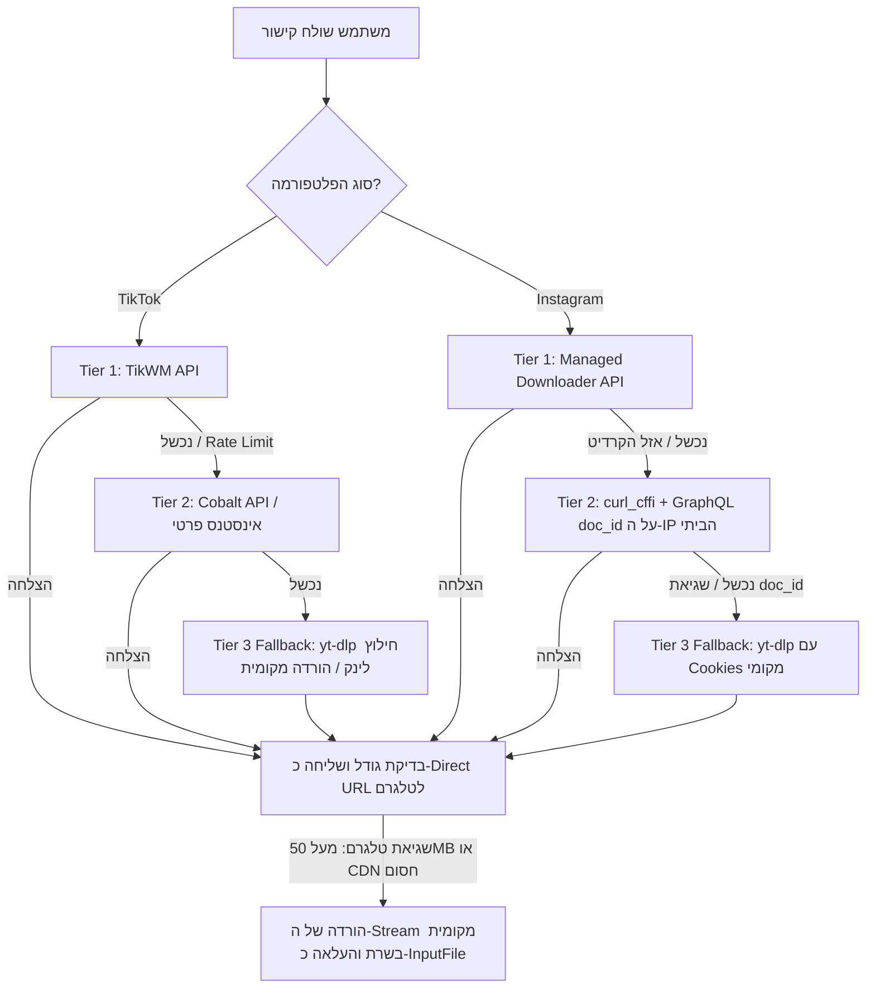

# דוח מחקר טכנולוגי: הורדה והזרמה מהירה של TikTok ו-Instagram (2026)
**פרויקט:** `media-bot-v2`  
**תאריך:** ספטמבר 2026  
**מטרה:** זיהוי הארכיטקטורה המהירה והאמינה ביותר להורדה והזרמה מיידית (Direct CDN Streaming) של סרטוני ומדיות TikTok ו-Instagram ללא הסתמכות על `yt-dlp` כברירת מחדל, עם דגש על סביבת ריצה ביתית (Residential IP) ומינימום תחזוקה שוטפת.

---

## 1. TikTok: ארכיטקטורה, שירותי API והמלצה חד-משמעית

### 1.1 המלצה חד-משמעית
הדרך המהירה ביותר (זמן תגובה ממוצע של 200–450 מילישניות לקבלת לינק ישיר) והיציבה ביותר ב-2026 היא שימוש ב-**TikWM API**.  
הבוט שולח בקשת HTTP אחת, מקבל קישור MP4 ישיר (ללא ווטרמרק) משרתי ה-CDN של TikTok/TikWM, ומעביר אותו ישירות ל-Telegram Bot API באמצעות הפרמטר `video` במתודת [`sendVideo`](https://core.telegram.org/bots/api#sendvideo).  
**התוצאה:** הבוט אינו מוריד את קובץ הווידאו לדיסק או לזיכרון ואינו מעלה אותו בעצמו – שרתי טלגרם מושכים ישירות את הווידאו מכתובת ה-CDN תוך 1–2 שניות.

---

### 1.2 סקירת שירותי API חיצוניים ל-TikTok

#### א. TikWM Public & Commercial API
* **אתר רשמי:** [tikwm.com](https://www.tikwm.com/) | שירות מסחרי: [tikwmapi.com](https://tikwmapi.com/)
* **Endpoint ציבורי (חינמי):**  
  `GET` או `POST` לכתובת:  
  `https://www.tikwm.com/api/`
* **פרמטרים:**
  * `url` (חובה): כתובת הסרטון בטיקטוק (תומך בקישורים קצרים `vt.tiktok.com` או מלאים).
  * `hd=1` (אופציונלי): בקשת קישור באיכות HD (1080p במידה וקיים).
* **שדות התשובה העיקריים (JSON):**
  * `code`: `0` להצלחה, ערך אחר לשגיאה.
  * `msg`: הודעת סטטוס (`"success"`).
  * `data.id`: מזהה הסרטון (Video ID).
  * `data.title`: כיתוב הסרטון (Caption).
  * `data.play`: כתובת MP4 ישירה ללא סימן מים (איכות סטנדרטית SD).
  * `data.hdplay`: כתובת MP4 ישירה באיכות HD ללא סימן מים.
  * `data.wmplay`: כתובת MP4 עם סימן מים מקורי.
  * `data.music`: כתובת MP3 ישירה של פס הקול.
  * `data.images`: מערך של מחרוזות URL (אם מדובר בפוסט תמונות / Photo Carousel / Slideshow).
* **מגבלות ומחירים:**
  * **שכבה חינמית:** ה-Endpoint של `https://www.tikwm.com/api/` פתוח לשימוש ללא צורך במפתח API (כפי שמשמש את האתר עצמו). המגבלה החינמית אינה מתועדת רשמית אך בפועל נחסמת על ידי Cloudflare באזור ה-60–100 בקשות לדקה לכל כתובת IP.
  * **שכבות בתשלום ([tikwmapi.com Pricing](https://tikwmapi.com/)):**
    * **Trial:** 18.00$ לחודש – 600,000 בקשות חודשיות (מגבלה של 600 בקשות/דקה).
    * **Pro:** 59.00$ לחודש – 3,000,000 בקשות חודשיות (מגבלה של 900 בקשות/דקה).
    * **Mega:** 359.00$ לחודש – ללא הגבלת בקשות (2,000 בקשות/דקה).
    * חיוב מתבצע אך ורק עבור תשובות HTTP 200 תקינות.
* **רמת יציבות ב-2026:** גבוהה מאוד (פעיל ויציב מזה מעל 4 שנים, מתעדכן באופן רציף מול שינויי החתימות של TikTok).

#### ב. Cobalt API (Self-Hosted / Public)
* **פרויקט:** [imputnet/cobalt ב-GitHub](https://github.com/imputnet/cobalt) | [Cobalt API Docs](https://github.com/imputnet/cobalt/blob/main/docs/api.md)
* **Endpoint:** `POST https://api.cobalt.tools/` (או אינסטנס פרטי ב-Docker)
* **פרמטרים:** JSON Body: `{"url": "https://www.tiktok.com/..."}`
* **שדות תשובה:** `{"status": "stream", "url": "https://..."}` או `{"status": "picker", "picker": [...]}`
* **מגבלות ושימוש:**
  * האינסטנס הציבורי (`api.cobalt.tools`) מוגן ב-Cloudflare Turnstile ואוסר מפורשות על שימוש על ידי בוטים חיצוניים.
  * **שימוש כ-Self-Hosted:** פריסה עצמית בקונטיינר Docker היא חינמית לחלוטין, אינה דורשת מפתח API, ומספקת שירות פרוקסי/חילוץ עצמאי.

#### ג. TikLiveAPI / TikLive Pro
* **אתר:** [tikliveapi.com](https://tikliveapi.com/)
* **מאפיינים:** מיועד בעיקר לכריית נתוני לייב (WebSockets, צ'אטים, מתנות) ופרופילים. אינו מותאם או כדאי כלכלית כ-Downloader ייעודי לקישורי וידאו בודדים בהשוואה ל-TikWM.

---

### 1.3 האם ניתן לחלץ ישירות מה-Web API הפנימי של TikTok?
* **המנגנון הפנימי:** TikTok משתמשת ב-Endpoints פנימיים כגון `https://www.tiktok.com/api/item/detail/?itemId=...` או ב-Feed של אפליקציית המובייל `https://api16-normal-c-useast1a.tiktokv.com/aweme/v1/feed/`.
* **מה נדרש לחילוץ ישיר:**
  1. **חתימות הצפנה מתחלפות:** TikTok מייצרת פרמטרים קריפטוגרפיים מורכבים ומוסווים (Obfuscated Wasm/JS): **`a_bogus`**, **`X-Bogus`**, ו-`_signature` (ראו סקירה ב-[RoundProxies TikTok Signature Guide](https://roundproxies.com/blog/tiktok-scraping-guide/) ו-[TikHub Anti-Bot Reverse Engineering](https://tikhub.io/)).
  2. **טוקנים:** `msToken` שמופק מתוך סשן ו-Device Identifiers.
  3. **עוגיות (Cookies):** עבור צפייה בסיסית בסרטונים ציבוריים עוגיות משתמש אינן חובה, אך נדרש מנגנון אימולציה מלא של דפדפן (Playwright / Puppeteer) או שרת RPC ייעודי לחתימת הבקשות (כפי שמתואר בספריית [davidteather/TikTok-Api](https://github.com/davidteather/TikTok-Api)).
* **רמת תחזוקה וכדאיות:** **"Break-Fix Treadmill" מתמיד**. טיקטוק מעדכנת את אלגוריתם ה-Wasm/חתימת `a_bogus` כל מספר שבועות/חודשים. תחזוקת מנגנון חתימה מקומי דורשת השקעת שעות פיתוח רבות ואינה מומלצת כשיש שירותים כמו TikWM.

---

### 1.4 ניתוח בוטים בקוד פתוח – במה הם משתמשים?
סריקת הפרויקטים המובילים ב-GitHub עבור הורדות TikTok בטלגרם:
* **[edizbaha/tiktok-downloader](https://github.com/edizbaha/tiktok-downloader):** בוט Node.js המבוסס במלואו על קריאות ישירות ל-TikWM API והעברת ה-URL לטלגרם.
* **[hostinger-bot/tiktok-tele-bot](https://github.com/hostinger-bot/tiktok-tele-bot):** בוט Node.js התומך בווידאו, תמונות ואודיו דרך ממשק TikWM.
* **[thejan64go/TikTokDownx-bot](https://github.com/thejan64go/TikTokDownx-bot):** בוט התומך בהזרמת קישורים ישירים והמרת MP3.
* **[TikYouBot](https://github.com/TikTok-Downloader-Bot/TikYouBot):** בוט מבוסס Rust שמבצע Fetch לקישורי CDN ושולח אותם ללא עיבוד מקומי.

---

### 1.5 מה קורה כשה-API החיצוני נופל? (Fallback Strategy)
1. **Tier 1 (ברירת מחדל מיידית):** קריאה ל-`https://www.tikwm.com/api/?url={URL}&hd=1`. קבלת `data.play` / `data.hdplay` ושליחה כ-URL לטלגרם. (זמן ביצוע: ~300ms).
2. **Tier 2 (Fallback ראשון):** קריאה לאינסטנס עצמאי של [Cobalt](https://github.com/imputnet/cobalt) או Endpoint חלופי (כגון TikHub / RapidAPI Free Tier).
3. **Tier 3 (Fallback אחרון):** הרצת `yt-dlp` מקומית עם משיכת ה-stream URL ישירות (`yt-dlp -g "URL"`) או הורדה לקובץ זמני והעלאה ידנית.

---

## 2. Instagram: מצב ההגנות, חלופות וניתוח סביבת ריצה ביתית

### 2.1 מה באמת עובד ב-2026? סקירת החלופות

| כלי / שיטה | מה דרוש? | חסימות / Rate Limits | סיכויי שרידות ב-2026 | הערכת כדאיות |
| :--- | :--- | :--- | :--- | :--- |
| **Instaloader** | חשבון אינסטגרם + Cookies | חסימת 429 מיידית, דרישת אימות (Checkpoint) | אפסית עד נמוכה מאוד | **לא מומלץ כלל.** נכשל באופן עקבי עקב זיהוי בוטים. |
| **yt-dlp עם Cookies** | קובץ `cookies.txt` עדכני | סכנת נעילת חשבון, הגבלת קצב של עשרות בודדות | בינונית (תלוי בחידוש עוגיות) | אפשרי כ-Fallback, איטי ומחייב תחזוקת עוגיות ידנית. |
| **GraphQL עם `doc_id` מקומי** | `curl_cffi` + `x-ig-app-id` + IP ביתי | סובל מרוטציית `doc_id` כל 2–4 שבועות | בינונית (נשבר בכל עדכון קוד של מטא) | פתרון חינמי טוב אך דורש תחזוקה תקופתית שוטפת. |
| **Managed External API (RapidAPI ודומיו)** | מפתח API (Key) | נשלט ע"י הספק (50–2,000 req/min) | גבוהה מאוד (99%+ Uptime) | **הפתרון המומלץ ביותר לאפס תחזוקה.** |

#### הרחבה על השיטות:
* **[Instaloader](https://instaloader.github.io/troubleshooting.html):** סובל ממשבר יציבות חריף לאורך 2025 ו-2026. אינסטגרם מזהה את חתימת הספרייה וחוסמת חשבונות באמצעות `Fatal error: Login: Checkpoint required` או שגיאות `429 Too Many Requests` כבר בבקשה הראשונה.
* **[yt-dlp](https://github.com/yt-dlp/yt-dlp):** ללא Cookies אינסטגרם מחזירה הפניה לעמוד התחברות (`login_required` / HTTP 302). שימוש ב-`--cookies-from-browser` או ייצוא קובץ `cookies.txt` מאפשר הורדה, אך כרוך בסיכונים: החשבון המחובר עלול להיחסם, העוגיות פגות תוקף כל כמה שבועות, ותהליך ההורדה המקומי דורש רוחב פס ומשאבי מעבד מהשרת של הבוט.
* **חילוץ ישיר דרך GraphQL (`/graphql/query`):**  
  אינסטגרם מבצעת שאילתות לקבלת פוסטים/רילס דרך:  
  `POST https://www.instagram.com/graphql/query`  
  עם Header של `x-ig-app-id: 936619743392459`, ופרמטרים: `doc_id` ומחרוזת JSON של `variables: {"shortcode": "..."}`.  
  התשובה מכילה ישירות את ה-`video_url` בשרתי ה-CDN של אינסטגרם (`scontent.cdninstagram.com`).  
  **עקב האכילס:** ערך ה-`doc_id` אינו קבוע – מטא מחליפה ומערבלת אותו בתוך קובצי ה-JavaScript המכווצים שלה (כגון `PolarisPostRoot.js`) מדי שבועיים עד ארבעה שבועות (ראו [Scrapfly Instagram Scraping Guide](https://scrapfly.io/blog/how-to-scrape-instagram/) ו-[Datadwip Instagram Scraper Guide](https://datadwip.com/blog/how-to-scrape-instagram-with-python/)).

---

### 2.2 ניתוח עומק: הבוט רץ על חיבור ביתי (Residential IP) – מה זה משנה בפועל?

העובדה ששרת הבוט יושב על חיבור אינטרנט ביתי (ולא בחוות שרתים כגון Hetzner, AWS או DigitalOcean) מהווה **יתרון אסטרטגי קריטי**, אך אינה פותרת את כל ההגנות:

#### מה החיבור הביתי פותר?
1. **חסימת טווחי IP של Data Centers (ASN Filtering):**  
   אינסטגרם חוסמת כברירת מחדל טווחי כתובות IP השייכים לספקי ענן ודאטה-סנטרים. כל פנייה מדאטה-סנטר ללא אותנטיקציה מלאה נזרקת מיד ל-`Login Wall` או מקבלת `HTTP 403 Forbidden`.
2. **מוניטין כתובת (IP Reputation):**  
   ספקיות אינטרנט ביתיות (Bezeq, Hot, Partner וכו') מקצות טווחי כתובות המשרתות משתמשים אמיתיים (לעיתים דרך CGNAT). מטא אינה יכולה לחסום טווחים אלה באופן גורף מבלי לפגוע במשתמשי קצה לגיטימיים של האפליקציה.

#### מה עדיין נדרש וחובה ליישם? (מה החיבור הביתי אינו פותר)
1. **טביעת אצבע של שכבת ה-TLS (JA3 / JA4 Fingerprinting):**  
   ספריות פייתון סטנדרטיות (`requests`, `urllib`, `aiohttp`, `httpx`) משתמשות במודול ה-OpenSSL המובנה של המערכת. שרתי ה-Edge של Meta (מערכות Proxygen / Akamai) בודקות את ה-`Client Hello` (רשימת ה-Cipher Suites, הרחבות ה-TLS, סדר ה-ALPN). טביעת אצבע של פייתון מסגירה מיד שמדובר בסקריפט אוטומטי ונחסמת גם אם הבקשה מגיעה מ-IP ביתי!  
   * **הפתרון הנדרש:** שימוש בספריית **[`curl_cffi`](https://github.com/lexiforest/curl_cffi)** עם פרמטר `impersonate="chrome"` (או `impersonate="safari"`). ספרייה זו מחקה בדיוק מושלם את חתימת ה-TLS של דפדפן Chrome אמיתי.
2. **טביעת אצבע של HTTP/2 (HTTP/2 Settings & Frame Sequence):**  
   פניות של דפדפנים נעשות ב-HTTP/2 עם הגדרות חלון וסדר כותרות ספציפיים. שימוש ב-`curl_cffi` מספק אימולציית HTTP/2 מלאה.
3. **כותרות דפדפן מדויקות (Headers):**  
   חובה להעביר כותרות אמינות:
   * `User-Agent` מודרני של Chrome.
   * `x-ig-app-id: 936619743392459` (מזהה ה-Web Client הציבורי).
   * כותרות `Sec-Fetch-Site: same-origin`, `Sec-Fetch-Mode: cors`, `Sec-Fetch-Dest: empty`.
4. **מגבלת קצב פר IP (Rate Limiting):**  
   גם ב-IP ביתי, אם הבוט יוציא 50 בקשות בתוך שניות בודדות מאותה כתובת, אינסטגרם תטיל השהיה זמנית (Soft Ban / 429) על ה-IP.

---

### 2.3 הדרך הדורשת את המינימום תחזוקה (The "Zero-Maintenance" Path)
עבור משתמש שמחפש **מינימום תחזוקה מוחלט לאורך זמן**, קיימות שתי אסכולות:

#### אפשרות א': שימוש ב-Managed Downloader API ייעודי (מינימום תחזוקה מוחלט)
* **איך זה עובד:** שימוש ב-API צד שלישי (מתוך [RapidAPI Instagram Downloaders](https://rapidapi.com/collection/instagram-downloader-apis) כגון "Instagram Post, Reels, Stories Downloader" או FastSaver).
* **מה זה דורש מאיתנו:**
  * יצירת חשבון ב-RapidAPI והשגת מפתח API (`X-RapidAPI-Key`).
  * קריאת HTTP פשוטה אחת: שולחים את ה-URL ומקבלים ישירות את ה-`video_url` של ה-CDN.
* **עלויות:** מסלולים חינמיים מספקים לרוב 50–500 בקשות חודשיות; מעבר לכך העלות היא כ-5$ עד 15$ לחודש עבור 10,000–50,000 בקשות.
* **רמת תחזוקה:** **0 מתוך 10.** ספק ה-API מתמודד עם רוטציית עוגיות, שינויי `doc_id`, פרוקסים ומעקף חסימות. הקוד שלכם לא משתנה לעולם.

#### אפשרות ב': Scraping ישיר עם `curl_cffi` על ה-IP הביתי (אפס עלות כספית, תחזוקה תקופתית)
* **איך זה עובד:** הבוט פונה ישירות ל-`https://www.instagram.com/graphql/query` באמצעות `curl_cffi` מהחיבור הביתי, מחלץ את ה-`video_url` ומזרים אותו לטלגרם.
* **מה זה דורש מאיתנו:**
  * התקנת `curl_cffi`.
  * תחזוקת משתנה סביבה עבור ה-`doc_id`.
  * **התעסקות תחזוקה שוטפת:** אחת ל-2–4 שבועות, כשהשאילתה תפסיק לעבוד (תחזיר `null`), יש לפתוח F12 בדפדפן, להעתיק את ה-`doc_id` החדש מעמוד רילס, ולעדכן אותו בהגדרות הבוט (או לחלופין לפתח מודול בדיקה אוטומטי מתוך ה-JS bundle).

---

## 3. טבלת השוואה כוללת בין החלופות

| פלטפורמה ושיטה | מהירות ממוצעת | אמינות ב-2026 | עלות כספית | ציון רמת תחזוקה (1=אפס, 10=גבוהה) | הערות מפתח |
| :--- | :--- | :--- | :--- | :--- | :--- |
| **TikTok: TikWM API** | **200–400ms** | **גבוהה מאוד** | **חינם** (18$ למסחרי) | **1/10** | **הבחירה המובילה.** מחזיר וידאו נקי, אודיו ותמונות. |
| **TikTok: Cobalt (Self-Hosted)** | 400–900ms | גבוהה | חינם | 3/10 | דורש הרצת קונטיינר Docker ייעודי כשרת מתווך. |
| **TikTok: Reverse Wasm / API פנימי** | 200–500ms | נמוכה | חינם | 9/10 | "Break-fix treadmill". החתימות משתנות כל הזמן. |
| **Instagram: Managed API (RapidAPI)** | **300–700ms** | **גבוהה מאוד** | **חינם** / 5–10$ חודשי | **1/10** | **אפס התעסקות.** הספק סופג את כל שינויי המטא. |
| **Instagram: `curl_cffi` + GraphQL** | **300–600ms** | בינונית-גבוהה | **חינם** | **5/10** | עובד מצוין על IP ביתי, אך דורש עדכון `doc_id` חודשי. |
| **Instagram: yt-dlp + Cookies** | 3,000–8,000ms | בינונית | חינם | 7/10 | איטי (מוריד ומעלה מקומית), עוגיות נשרפות ומחייבות חידוש. |
| **Instagram: Instaloader** | לא רלוונטי | נמוכה מאוד | חינם | 10/10 | נחסם מיידית ב-429 או נעילת Checkpoint. |

---

## 4. מה נדרש מאיתנו כדי להתחיל בפועל?

### עבור TikTok (מוכן מיידית ללא דרישות מוקדמות):
* **חשבון טיקטוק:** **לא נדרש.**
* **Cookies:** **לא נדרש.**
* **מפתח API:** **לא נדרש** עבור ה-Endpoint הציבורי של TikWM.
* **ספריות נדרשות:** ספריית HTTP רגילה (כגון `httpx` או `aiohttp`).
* **אופן המימוש:**
  ```python
  import httpx

  async def get_tiktok_stream_url(tiktok_url: str) -> dict:
      async with httpx.AsyncClient() as client:
          resp = await client.get(f"https://www.tikwm.com/api/?url={tiktok_url}&hd=1")
          data = resp.json()
          if data.get("code") == 0:
              media = data["data"]
              # מחזיר קישור וידאו ישיר או גלריית תמונות
              return {
                  "type": "video" if "play" in media else "images",
                  "video_url": media.get("hdplay") or media.get("play"),
                  "images": media.get("images", []),
                  "caption": media.get("title", "")
              }
  ```

### עבור Instagram:
* **במסלול ה-Managed API (המומלץ למינימום תחזוקה):**
  * חשבון RapidAPI פעיל.
  * שמירת ה-`X-RapidAPI-Key` בקובץ הקונפיגורציה (`.env`).
  * ללא צורך בחשבון אינסטגרם, ללא Cookies, וללא פרוקסי.
* **במסלול ה-Direct Scraper (`curl_cffi` על החיבור הביתי):**
  * התקנת `curl_cffi`.
  * משתנה קונפיגורציה עבור ה-`INSTAGRAM_DOC_ID` העדכני.
  * שימוש ב-Header של `x-ig-app-id: 936619743392459`.
  * ללא צורך בחשבון אינסטגרם (עבור פוסטים ורילס ציבוריים).

---

## 5. סיכונים, ואסטרטגיית נפילה חזרה (Fallback Architecture)

### 5.1 הסיכונים העיקריים
1. **שינויי אנטי-בוט פתאומיים:** מטא מחליפה את ה-`doc_id` או מתחילה לדרוש Proof-of-Work / Captcha.
2. **חסימת קצב ב-TikWM:** אם הבוט יחווה גידול פתאומי, ה-Endpoint הציבורי של TikWM עשוי להחזיר HTTP 429 או עמוד Cloudflare Challenge.
3. **הגבלת גודל בטלגרם (Telegram 50MB URL limit):** מתודת `sendVideo` עם URL מוגבלת בשרתי טלגרם לקבצים עד 50 מגה-בייט. אם סרטון טיקטוק ארוך או באיכות גבוהה במיוחד חורג מ-50MB, טלגרם תחזיר שגיאת הורדה.

### 5.2 מנגנון הזרמה ונפילה חזרה רב-שלבי (Cascading Fallback)



#### לוגיקת הנפילה המעשית:
1. **הזרמה ישירה ראשונית:** הבוט מקבל את ה-CDN URL ומנסה לבצע:  
   `bot.send_video(chat_id, video=cdn_url)`
2. **טיפול בחריגת גודל (File Too Large):** אם טלגרם מחזירה שגיאה שהקובץ גדול מדי עבור העברה ב-URL (>50MB), הבוט מוריד את ה-Stream מה-CDN לזיכרון (RAM / BytesIO) ומעלה אותו כקובץ מקומי (בוטים יכולים להעלות עד 2GB כקובץ מקומי).
3. **טיפול בנפילת ספק ראשי:** אם קריאת ה-API הראשית מחזירה שגיאה שאינה 200, מתבצע מעבר אוטומטי שקוף למדרגת הגיבוי (Tier 2 / Tier 3) בתוך אותו תהליך, מבלי שהמשתמש יחווה כישלון.

---

## 6. לינקים ומקורות מידע לאימות

1. **TikWM & TikTok APIs:**
   * האתר והשירות הציבורי: [https://www.tikwm.com/](https://www.tikwm.com/)
   * תמחור ומפרט API רשמי: [https://tikwmapi.com/](https://tikwmapi.com/)
   * ניתוח מבנה התשובות וה-Endpoints: [Medium – TikWM API Integration Guide](https://medium.com/@dev_tikwm/tikwm-api-guide)
   * מחקר מנגנוני חתימות TikTok (`a_bogus`, `X-Bogus`): [RoundProxies Scraping Guide](https://roundproxies.com/blog/tiktok-scraping-guide/) ו-[TikHub Platform](https://tikhub.io/)
2. **בוטים בקוד פתוח (TikTok & Telegram):**
   * בוט Node.js מבוסס TikWM: [edizbaha/tiktok-downloader (GitHub)](https://github.com/edizbaha/tiktok-downloader)
   * בוט מולטי-מדיה: [hostinger-bot/tiktok-tele-bot (GitHub)](https://github.com/hostinger-bot/tiktok-tele-bot)
   * פרויקט Cobalt (מנוע הורדה חופשי): [imputnet/cobalt (GitHub)](https://github.com/imputnet/cobalt) | [Cobalt API Docs](https://github.com/imputnet/cobalt/blob/main/docs/api.md)
   * ספריית TikTok-Api לפייתון: [davidteather/TikTok-Api (GitHub)](https://github.com/davidteather/TikTok-Api)
3. **Instagram Scraping, TLS & GraphQL:**
   * מדריך מקיף לסריקת אינסטגרם ו-GraphQL: [Scrapfly – How to Scrape Instagram](https://scrapfly.io/blog/how-to-scrape-instagram/)
   * חילוץ מידע בעזרת GraphQL ו-`doc_id`: [Datadwip – Instagram GraphQL Scraping](https://datadwip.com/blog/how-to-scrape-instagram-with-python/)
   * ספריית מעקף טביעות אצבע TLS: [curl_cffi (GitHub)](https://github.com/lexiforest/curl_cffi) ו-[curl_cffi Documentation](https://curl-cffi.readthedocs.io/)
   * בעיות Instaloader ו-Checkpoints: [Instaloader Troubleshooting Official](https://instaloader.github.io/troubleshooting.html)
   * סוגיות `yt-dlp` והתחברות לאינסטגרם: [yt-dlp Issues & Documentation](https://github.com/yt-dlp/yt-dlp)
   * שירותי הורדה לאינסטגרם: [RapidAPI Instagram Downloader Collection](https://rapidapi.com/collection/instagram-downloader-apis)
4. **Telegram Bot API:**
   * מפרט מתודת `sendVideo` והעברת קישור ישיר: [Telegram Bot API Documentation – sendVideo](https://core.telegram.org/bots/api#sendvideo)
